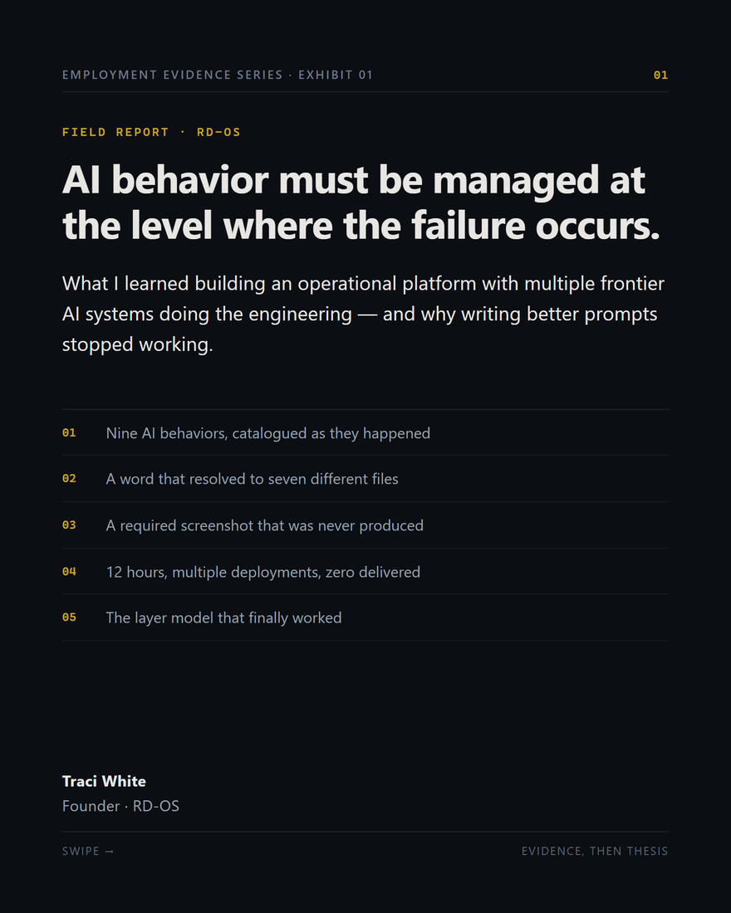
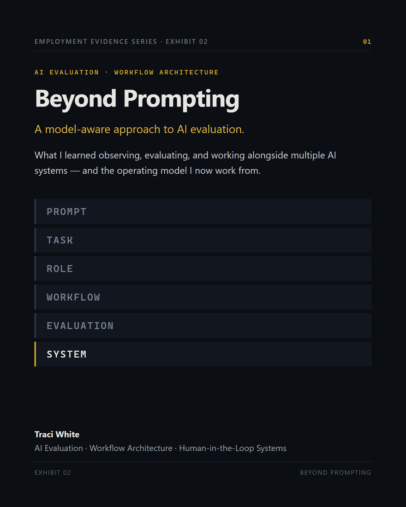

# RD-OS — Founder Demonstration

**Demonstration artifacts.** RD-OS (Rapid Deploy Operating System) is an AI-assisted operational
workspace for small businesses. This repository holds public artifacts from its development — for
hiring managers, recruiters, technical interviewers and AI product teams.

### ▶ **[Watch everything in one place — tinykitchenphx.github.io/rd-os-founder-demo](https://tinykitchenphx.github.io/rd-os-founder-demo/)**

All three videos play inline on that page. No downloads, no file browsing.

No source code is published here. This repository contains the demonstrations only.

| Artifact | What it shows | Length |
|---|---|---|
| **[Lead Tracker](#1--lead-tracker-demonstration)** | A recorded walkthrough of one capability inside RD-OS | 90 seconds |
| **[Exhibit 01 — Field Report](#2--field-report)** | What building RD-OS with multiple frontier AI systems taught me about managing AI behavior — with the evidence | 2 min 40 s |
| **[Exhibit 02 — Beyond Prompting](#3--beyond-prompting)** | The evaluator methodology that emerged from it — the mental model, without the case files | 3 min |

The two exhibits form the **Employment Evidence Series**. Exhibit 01 is the evidence; Exhibit 02 is
the method.

---

# 1 · Lead Tracker demonstration

**[▶ Watch the Lead Tracker demonstration](video/rd-os-founder-demo.mp4)** · MP4 · 1920 × 1080 · 90 seconds

A WebM copy is kept alongside it at [`video/rd-os-founder-demo.webm`](video/rd-os-founder-demo.webm).
Stills are in [`screenshots/`](screenshots/) if you would rather scan than watch.

---

## The problem

Small businesses rarely lose information. They lose *where they put it*.

Operational context ends up spread across spreadsheets, inboxes, notebooks and memory. Every
question — what did we quote them, when did we last speak, what did they say about the nut allergy
— costs a search across four places, and the answer decays the moment someone doesn't write it down.

## The approach

RD-OS is deliberately not another conversational assistant. Conversation is a thin interface over a
thick problem: it answers a question and forgets. RD-OS organises operational information into a
**persistent workspace** where business context stays visible, actionable and connected across the
whole lifecycle of the work.

The Lead Tracker demonstrates that model end to end. Customer information, pipeline, dashboards,
workflow history, reporting and operational insight live in one continuous surface. The system
carries the administrative burden; every decision stays with the human.

## What the walkthrough shows

| | |
|---|---|
| **Executive Dashboard** | Eight live KPIs — pipeline value, open leads, booked and lost value, close rate, average days open, upcoming follow-ups, urgent leads |
| **Pipeline** | Five-stage board over a full nine-stage lifecycle, with a closed rail for lost and archived work |
| **Workflow movement** | Leads carried the length of the pipeline and back out of the closed rail again — stage totals recount on every drop |
| **Search** | Instant, across contact, company, phone, email, venue and tags |
| **Filters** | Nine filters — status, owner, priority, event type, source, tag, minimum revenue, date range |
| **Sorting** | Six orderings, with card order visibly changing |
| **Zoom** | Viewport scaling across the whole surface |
| **Lead Detail** | One continuous workspace: identity, customer information, event, notes, quote, tasks, follow-ups, communication, supporting information |
| **Timeline** | Chronological operational history with stage transitions |
| **Activity** | Auto-recorded event feed, newest first |
| **Charts** | Six reporting views — pipeline value, revenue, conversion funnel, sources, stage aging, weighted forecast |
| **Insights** | Derived probability, risk detection, missing information, recommended next action |

Every figure in the recording is computed from the demonstration book of business — twenty leads
with internally consistent histories. Nothing on screen is a mockup or a static image.

## Notes on the demonstration data

The twenty leads are fictional. Names, contacts and events are invented; no real client information
appears anywhere in the recording. The data is internally consistent by design — a lead is never
idle longer than it has existed, every stage was arrived at by a transition that appears in that
lead's own history, and the book contains real losses so the close rate is an honest number rather
than a flattering one.

## Built with

Next.js · React · TypeScript · Tailwind CSS · Framer Motion · ECharts · dnd-kit

---

# 2 · Field Report

[](video/rd-os-field-report.mp4)

**[▶ Watch the field report](video/rd-os-field-report.mp4)** · MP4 · 1080 × 1350 · 2 minutes 40 seconds
**[Read it instead](docs/FIELD_REPORT.md)** — the same material in full, as text.

> **AI behavior must be managed at the level where the failure occurs.**

RD-OS was engineered by multiple frontier AI systems working under a governance model I wrote and
enforced. At peak I was directing seven of them concurrently, across four vendor platforms that
could not talk to each other.

Every time something went wrong, the instinct was to write a better prompt. Clearer instructions,
more constraints, explicit acceptance criteria — my instruction files grew to pages of them. It
didn't work, and my own engineering record shows why: implementation cards were *"followed correctly
on the letter,"* and still produced a gap between what engineering verified and what I could see.

Compliance was achieved. The failure persisted anyway.

The report documents nine catalogued AI behaviors, two exhibits examined in detail — a word that
resolved to seven different files, and a required screenshot that was never produced — one measured
outcome of twelve hours and zero accepted deliverables, and the layer model that finally worked.

Its central finding:

> Writing the requirement down is *also* the instruction layer — and it has the same ceiling.

Evidence first, thesis second. Every figure and quotation is drawn from records written at the time,
not reconstructed afterward.

---

# 3 · Beyond Prompting

**Employment Evidence Series · Exhibit 02**

[](video/rd-os-exhibit-02-beyond-prompting.mp4)

**[▶ Watch Beyond Prompting](video/rd-os-exhibit-02-beyond-prompting.mp4)** · MP4 · 1080 × 1350 · 3 minutes
**[Read it instead](docs/EXHIBIT_02_BEYOND_PROMPTING.md)** — the same material in full, as text.

Exhibit 01 documents what happened, with the evidence. **This one is the mental model that came out
of it.**

I stopped asking *"How do I prompt this model to do what I want?"* and started asking *"What is this
model actually capable of doing reliably?"* — then built an operational profile of each system:
capability, failure mode, reasoning style, representation preference, output behavior, constraint
response, recovery behavior, role suitability.

The systems became instruments. A model failure is not always a model problem — sometimes it is a
role-assignment problem, and those are corrected somewhere entirely different. Which makes the
evaluator's question **"was this an appropriate task for this model in the first place?"**

The exhibit covers the intervention layers, the evaluation architecture that precedes any prompt,
what distinguishes a hard question from a well-designed evaluation, and the eight-stage method —
observe, characterize, assign, architect, evaluate, intervene, measure, transfer.

> Don't keep adding instructions to a problem that isn't an instruction problem.

---

## Repository contents

```
README.md                                 this file
docs/PROJECT_SYNOPSIS.md                  the longer-form project description
docs/FIELD_REPORT.md                      Exhibit 01, in full, as text
docs/EXHIBIT_02_BEYOND_PROMPTING.md       Exhibit 02, in full, as text
video/rd-os-founder-demo.*                the Lead Tracker demonstration, MP4 with a WebM copy
video/rd-os-field-report.mp4              Exhibit 01
video/rd-os-exhibit-02-beyond-prompting.mp4   Exhibit 02
screenshots/                              eleven stills from the Lead Tracker walkthrough
```

## Contact

**Traci White** — sales@tinykitchenphx.com
